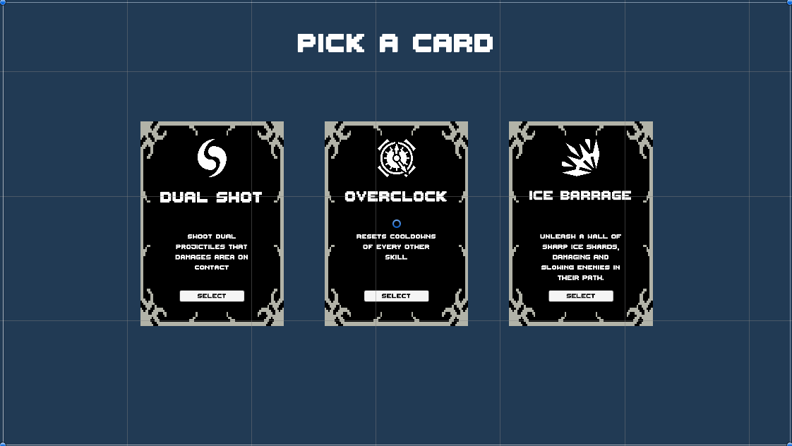
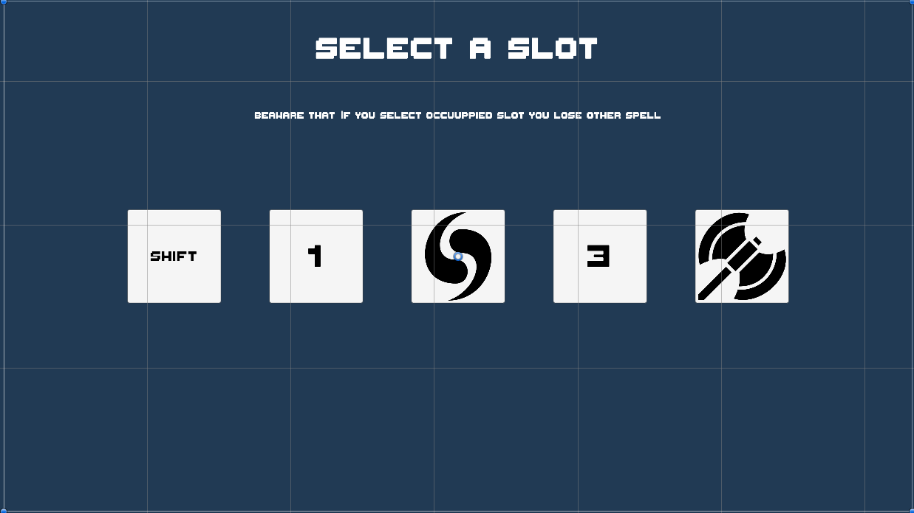

# Unity-NextRogue

<h1 align = "center"> INTRODUCTIONS </h1>

- [Game Design Document](#gamedesignDoc)
    - [Game Details](#gameDetails)
    - [Gameplay Elements](#gameplayElements)
      - [Player Mechanics](#playermechanics)
        - [Spells](#playerSpells)
      - [Playable Characters](#playableCharacters)
        - [Necromancer](#necromancer) 
        - [Bloodshaper](#bloodshaper) 
        - [Rogue](#rogue) 
      - [Enemies](#enemies)
        - [Humans](#humans)
        - [Orcs](#orcs)
        - [Other](#other)
      - [Bosses](#bosses)
        - [Human Boss](#humanboss)
        - [Orc Boss](#orcboss)
      - [Map System](#maps)
     - [Visuals](#visuals)
       - [User Interface](#UI)
 - [Development Flow](#developmentFlow)

<h1 align = "center" id = "gamedesignDoc"> GAME DESIGN DOCUMENT </h1>

<h1 align = "center" id = "gameDetails"> GAME DETAILS </h1>

- 
 Name :        Project - NextRogue

- 
 Genre :       Action - RogueLike/Lite

- 
 Art Style :   2D - TopDown

  
<h1 align = "center" id = "gameplayElements"> GAMEPLAY ELEMENTS </h1>

<h2 align = "center" id = "playermechanics" >PLAYER MECHANICS</h2>

I want a fast gameplay so fluid character controller is mandatory. 

Main combat will be built on wizardry. There will be more than 3 unlockable characters in the game. Player can open them by playing the game.

There will be personality trait actives and passives.

Actives :
  - Primary Support : PS
  - Secondary Support : SS
  - Primary Attack : PA 
  - Seconray Attack : SA

There are no strict restrictions on passives so they will have different and quite unique passives. 

<h3 align = "center" id = "playerSpells">SPELLS</h3>

And there is spells. Any character has 5 skill slots which player can attach different spells on each run. Player will find new spells while on chests or they will be given on after boss fights.

Oher characters attacks might be used as spells in game.

Spell List :

  - Dual Shot
    - Shoots a dual projectile that explodes and give AoE on contact eachother
    - 
            Cooldown : 15
            Damage : 50
  - Ice Barrage
    - Throws 5 ice pieces in a few inches between them
    - 
            Cooldown : 20
            Damage : 15
  - Healing Ward
    - Deflects all projectiles for 1 second and heals player
    - 
            Cooldown : 15
            Heal Per Hit : 2 
  - Berserk Throw
    - Throws an axe
    - Can pick it up to reset cooldown
    -  
            Cooldown : 10
            Damage : 10
  - Overclock
    - Reesets all cooldowns
    -  
            Cooldown : 30 
  - Stitched Fortress
    - Creates a wall
    -  
            Cooldown : 15
            LifeSpan : 5
  - Subjugate Will
    - Enchant targets will to get it to your side
    -  
            Cooldown : 20  

  - Arcane Infusion
    - Reduce cooldown and increase power of character skills
    -  
            Cooldown : 20
            Cooldown Reduce : %25
            Power Increase : %15
            Time : 10

  - Shrapnel Strike
    - Shoot a projectile that turns into little ones on impact
    -  
            Cooldown : 15
            Damage : 10
            Shard Damage : 2

  - Celestial Blast 
    - Create a shield if it does not break on time it explodes
    -  
            Cooldown : 20
            Shield Health : 25
            Damage : 5
            Lifespan : 5 

  - Impailing Shot
    - Shoot a piercing projetile
    -  
            Cooldown : 15
            Damage : 25

  - Spike Trap
    - Create spikes to damage enemies
    -  
            Cooldown : 10
            Damage : 10

<h2 align = "center" id = "playableCharacters"> PLAYABLE CHARACTERS</h2>

<h3 align = "center" id = "necromancer"> NECROMANCER</h3> 

  

  
  

    Health : 75
    Movement Speed : 3

  - PS: Necrotic Dash
    - It dashes more if there are dead bodies around
    - 
            Cooldown : 3
            Dash Force : 10
            Corpse Range : 5
            Corpse Multiplier : 1.2

  - SS: Consume
    - Consumes corpses to heal
    - 
            Cooldown : 15
            Default Heal : 0
            Corpse Range : 5
            Heal Per Corpse : 3

  - PA: Reaper
    - Summons a reaper that seings itself and damages the enemies on the way
    -  
            Cooldown : 2
            Damage : 10

  - SA: Summon Aid
    - Summon 4 Axe Skeleton to help the player
    - 
            Cooldown : 10
    - Axe Skeleton:
      - Melee
      - Follow
      - 
            Health : 20
            Movement Speed : 4
            Attack Damage : 10
            Attack Range : .5
            Attack Speed : .75
            Life Span : 5

<h3 align = "center" id = "bloodshaper"> BLOODSHAPER</h3>  
  

  
  

    Health : 100
    Movement Speed : 2.5

  - PS: Hemomorphosis
    - Gets in to a blood lake and becomes invincable while gaining speed for a short amount of time and heal
    - Speed and Time increases with the Cell Vial stacks
    - 
            Cooldown : 5
            Speed Multiplier : 2
            Invincible Time : 1 
            - Blood Vial Speed Increase : +.2
            - Blood Vial Invincible Time Increase : +.2
            - Max Speed : 3
            - Max Invincible Time : 3
            - Heal Increase : 1
            - Max Heal : 5

  - SS: Cell Vial
    - Consumes nearby blood drops as cell stacks
    - 
            Cooldown : 2 
            Blood Range : 10 
            Max Stacks : 5

  - PA: Blood Shot
    - Shoots a projectile to cursor position
    -  
            Cooldown : .5
            Damage : 5

  - SA: Drain Bolt
    - Shoots a projectile that uses Cell Vial stacks as damage
    -  
            Cooldown : 7
            Damage : 0
              - Blood Vial Damage Increase : +15
              - Max Damage : 75

<h3 align = "center" id = "rogue"> ROGUE</h3>  

  

  
  

      Health : 50
      Movement Speed : 3.5

  - PS: Shadow Step
    - Teleport to the closest enemy to the cursor 
    - Starts a timer to crit
    - 
            Cooldown : 3
            Crit Timer : .75
            Crit Multiplier : 4

  - SS: Mirror Illusionary 
    - Creates a clone of itself to distract enemies
    - 
            Cooldown : 15
    - Clone:
      - Melee
      - Stay
      - 
            Health : 100
            Movement Speed : 0
            Attack Damage : 0
            Attack Range : 0
            Attack Speed : 0
            Life Span : 10

  - PA: Night Strike
    - Melee attack that doesn't hit area
    - Can be multiplied by crit
    -  
            Cooldown : .75
            Damage : 15
            Crit Damage : 60

  - SA: Death's Knife
    - Throws a knife
    -  
            Cooldown : 1
            Damage : 5

<h2 align = "center" id = "enemies"> ENEMIES</h2>

<h3 align = "left" id = "humans"> HUMANS</h3> 

- Crusader:
    - Melee
    - Follow
    - Heals self when hp is lower than half. 5 secs cooldown.
    - 
          Health : 40
          Movement Speed : 1.5
          Attack Damage : 5
          Attack Range : .75
          Attack Speed : 1
- Thief:
    - Dash
    - Keep Distance
    - Tp's to behind the player. Hits. And Tp's back.
    -
          Health : 15
          Movement Speed : 2.5
          Attack Damage : 12
          Attack Range : 3
          Attack Speed : 3
- Marksman:
    - Ranged
    - Keep Distance
    - Shoots three arrows on normal cooldown. After that waits for 3 times more as normal.
    - 
          Health : 25
          Movement Speed : 2
          Attack Damage : 13
          Attack Range : 4
          Attack Speed : 1

<h3 align = "left" id = "orcs"> ORCS</h3> 

Under-development

<h3 align = "left" id = "other"> OTHER</h3> 

- Hunter:
    - Melee
    - Follow
    - 
          Health : 40
          Movement Speed : 2.5
          Attack Damage : 20
          Attack Range : .75
          Attack Speed : 1
- Bat
    - Dash
    - Keep Distance
    -
          Health : 15
          Movement Speed : 3
          Attack Damage : 15
          Attack Range : 5
          Attack Speed : 3
- Arcane Archer
    - Ranged
    - Keep Distance
    - 
          Health : 20
          Movement Speed : 3.5
          Attack Damage : 5
          Attack Range : 4
          Attack Speed : 2
  

<h2 align = "center" id = "bosses"> BOSSES</h2> 

<h3 align = "left" id = "humanboss"> HUMAN BOSS</h3> 

- name
    - Melee
    - Follow
    - 
          Health : x
          Movement Speed : x
          Attack Damage : x
          Attack Range : x
          Attack Speed : x

PHASE 1 SKILLS: 

    - Arrow Rain:
      - Boss will order the marksmen in the castle to shoot their arrows.
          - Condition : 
          - Cooldown :
          - Arrow Damage :
          - Arrow Count : 
    - Cavalry Attack:
      - Boss will order the cavalry on the sides to rush to the other side.
      - The Cavalry will damage player if touches.
          - Condition : 
          - Cooldown :
          - Cavalry Damage :
          - Cavalry Count : 
    - Tactical Reposiitioning:
      - Boss will dash as Thief enemy to gain some space or get closer. 
          - Condition : If boss has lots of health and too far away to the player or boss has low health and too close to the player.
          - Cooldown :  

An in-between phase will start when boss dies. Army on the castle will get down in a rage. The crusaders will healh him while player is occupied with the army. Inbetween pahse will end and the 2nd phase wwil start when player kills all of the enemies.

Boss will be much more aggressive on this phase

PHASE 2 SKILLS:    

    - Oath of Honor :
      - Boss will get stronger shouting an oath of honor. 
          - Condition : One time use
          - Cooldown :  One time use
    - Guardian Shield :
      - Boss will get a indestructable shield and become invincible for the time. 
          - Condition : 
          - Cooldown :  
          - Shield Duration :  
    - Ground Shaker : 
      - Boss will use a slow and heavy attack to create sismic waves. 
          - Condition : 
          - Cooldown : 
    - Sledgehammer Volley: 
      - Boss will throw its weapon as a boomerang. 
          - Condition : 
          - Cooldown :   
    - War Cry:
      - Boss will shout and push the player away.
      - It can resault with the player pressing some traps and loosing health.
          - Condition : 
          - Cooldown :    

The castle doors will be lowered and player will get the portal inside after phase 2. From that portal game will contuniue in the orc controlledarea.

<h3 align = "left" id = "orcboss"> ORC BOSS</h3> 

Under-development

<h2 align = "center" id = "maps"> MAP SYSTEM</h2>

There is 4 kinds of maps to design. 

- Tutorials: 
  - Every playable character has its own tutorial scene that only played on the first run of that character.
  - It teaches the player how that character works.
- Dungeons: 
  - Normal rogue-like type of procedurally generated maps.
- Shops:
  - A safe place where player can buy new skills or some health before continuing the action.
- Bosses:
  - A boss fight room.
  - Not procedurally generated.

Every race has 3 rooms. First you go into the shop of that race. Than you proceed to the dungeon room. After that you will encounter the boos of that race.
Every race's dungen will have its own unique enemies and traps.
And the bosses will be design to represent that race as much as possible.

<h1 align = "center" id = "visuals"> VISUALS </h1>
  <h2 align = "center" id = "UI"> GAME </h2>
  

  
  

  <h2 align = "center" id = "UI"> USER INTERFACE </h2>
  

  
  
  
  

  
  
   
  

   
  
 

<h1 align = "center" id = "developmentFlow"> DEVELOPMENT FLOW </h1>
  <h2 align = "center"> PLAYER CONTROLLER </h2>
  

  
  

  <h2 align = "center"> ENEMY CONTROLLER </h2>
  

  
  

