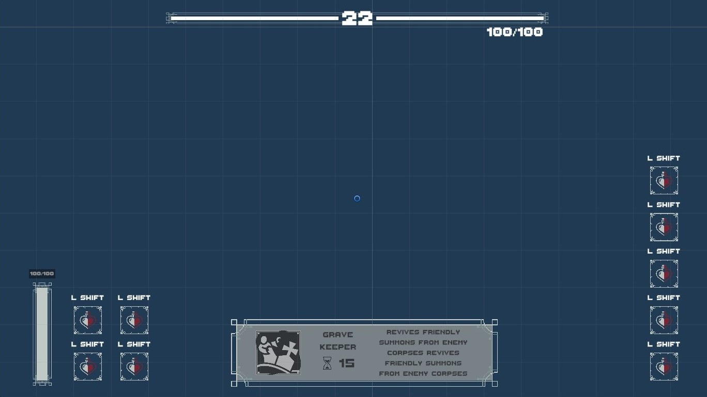
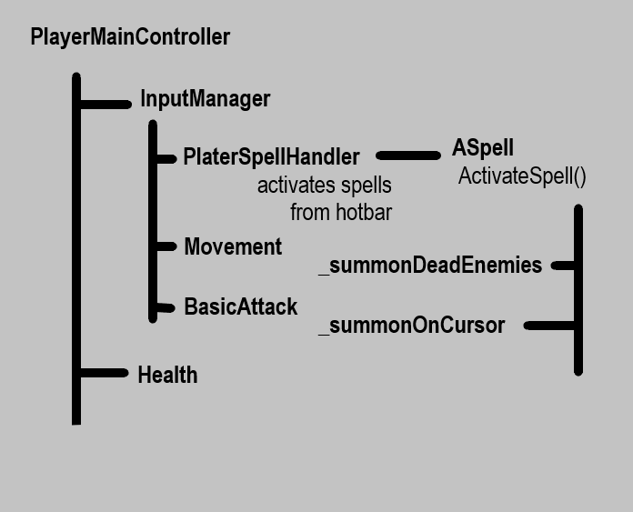
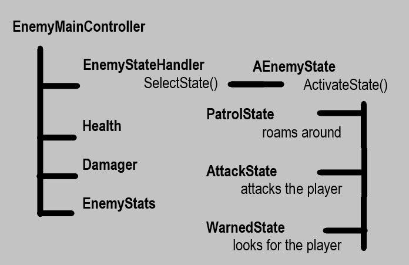

# Unity-NextRogue

<h1 align = "center"> INTRODUCTIONS </h1>

- [Game Design Document](#gamedesignDoc)
    - [Game Details](#gameDetails)
    - [Gameplay Elements](#gameplayElements)
      - [Player Mechanics](#playermechanics)
        - [Spells](#playerSpells)
      - [Playable Characters](#playableCharacters)
        - [Necromancer](#necromancer) 
        - [Hemomancer](#hemomancer) 
        - [Rogue](#rogue) 
      - [Non Players](#enemies)
     - [Visuals](#visuals)
       - [User Interface](#UI)
 - [Development Flow](#developmentFlow)

<h1 align = "center" id = "gamedesignDoc"> GAME DESIGN DOCUMENT </h1>

<h1 align = "center" id = "gameDetails"> GAME DETAILS </h1>

- 
 Name :        Project - NextRogue

- 
 Genre :       Action - RogueLike/Lite

- 
 Art Style :   2D - TopDown

  
<h1 align = "center" id = "gameplayElements"> GAMEPLAY ELEMENTS </h1>

<h2 align = "center" id = "playermechanics" >PLAYER MECHANICS</h2>

I want a fast gameplay so fluid character controller is mandatory. 

Main combat will be built on wizardry. There will be more than 3 unlockable characters in the game. Player can open them by playing the game.

There will be personality trait actives and passives.

Actives :
  - Primary Support : PS
  - Secondary Support : SS
  - Primary Attack : PA 
  - Seconray Attack : SA

There are no strict restrictions on passives so they will have different and quite unique passives. 

<h3 align = "center" id = "playerSpells">SPELLS</h3>

And there is spells. Any character has 5 skill slots which player can attach different spells on each run. Player will find new spells while on chests or they will be given on after boss fights.

Oher characters attacks might be used as spells in game.

Spell List :

  - Dual Shot
    - Shoots a dual projectile that explodes and give AoE on contact eachother
    - 
            Cooldown : 15
            Damage : 50
  - Ice Barrage
    - Throws 5 ice pieces in a few inches between them
    - 
            Cooldown : 20
            Damage : 15
  - Healing Ward
    - Deflects all projectiles for 1 second and heals player
    - 
            Cooldown : 15
            Heal Per Hit : 2 
  - Berserk Throw
    - Throws an axe
    - Can pick it up to reset cooldown
    -  
            Cooldown : 10
            Damage : 10
  - Overclock
    - Reesets all cooldowns
    -  
            Cooldown : 30 
  - Stitched Fortress
    - Creates a wall
    -  
            Cooldown : 15
            LifeSpan : 5
  - Subjugate Will
    - Enchant targets will to get it to your side
    -  
            Cooldown : 20  

  - Arcane Infusion
    - Reduce cooldown and increase power of character skills
    -  
            Cooldown : 15
            Cooldown Reduce : %25
            Power Increase : %15
            Time : 5

  - Shrapnel Strike
    - Shoot a projectile that turns into little ones on impact
    -  
            Cooldown : 15
            Damage : 10
            Shard Damage : 2

  - Celestial Blast 
    - Create a shield if it does not break on time it explodes
    -  
            Cooldown : 20
            Shield Health : 25
            Damage : 5
            Lifespan : 5 

  - Impailing Shot
    - Shoot a piercing projetile
    -  
            Cooldown : 15
            Damage : 25

<h2 align = "center" id = "playableCharacters"> PLAYABLE CHARACTERS</h2>

<h3 align = "center" id = "necromancer"> NECROMANCER</h3> 

  

  
  

    Health : 75
    Movement Speed : 3

  - PS: Necrotic Dash
    - It dashes more if there are dead bodies around
    - 
            Cooldown : 3
            Dash Force : 10
            Corpse Range : 5
            Corpse Multiplier : 1.2

  - SS: Consume
    - Consumes corpses to heal
    - 
            Cooldown : 15
            Default Heal : 0
            Corpse Range : 5
            Heal Per Corpse : 3

  - PA: Reaper
    - Summons a reaper that seings itself and damages the enemies on the way
    -  
            Cooldown : 2
            Damage : 10

  - SA: Summon Aid
    - Summon 4 Axe Skeleton to help the player
    - 
            Cooldown : 10
    - Axe Skeleton:
      - Melee
      - Follow
      - 
            Health : 20
            Movement Speed : 4
            Attack Damage : 10
            Attack Range : .5
            Attack Speed : .75
            Life Span : 5

<h3 align = "center" id = "hemomancer"> HEMOMANCER</h3>  
  

  
  

    Health : 100
    Movement Speed : 2.5

  - PS: Hemomorphosis
    - Gets in to a blood lake and becomes invincable while gaining speed for a short amount of time
    - Speed and Time increases with the Cell Vial stacks
    - 
            Cooldown : 10
            Speed Multiplier : 2
            Invincible Time : 3 
            - Blood Vial Speed Increase : +.2
            - Blood Vial Invincible Time Increase : +.1
            - Max Speed : 3
            - Max Invincible Time : 3.5

  - SS: Cell Vial
    - Consumes nearby blood drops as cell stacks
    - 
            Cooldown : 2 
            Blood Range : 5 
            Max Stacks : 5

  - PA: Blood Bolt
    - Shoots a projectile to cursor position
    -  
            Cooldown : .5
            Damage : 5

  - SA: Blood Bolt
    - Shoots a projectile that uses Cell Vial stacks as damage
    -  
            Cooldown : 7
            Damage : 0
              - Blood Vial Damage Increase : +15
              - Max Damage : 75

<h3 align = "center" id = "rogue"> ROGUE</h3>  

  

  
  

      Health : 50
      Movement Speed : 3.5

  - PS: Shadow Step
    - Teleport to the closest enemy to the cursor 
    - Starts a timer to crit
    - 
            Cooldown : 3
            Crit Timer : .75
            Crit Multiplier : 4

  - SS: Mirror Illusionary 
    - Creates a clone of itself to distract enemies
    - 
            Cooldown : 15
    - Clone:
      - Melee
      - Stay
      - 
            Health : 100
            Movement Speed : 0
            Attack Damage : 0
            Attack Range : 0
            Attack Speed : 0
            Life Span : 10

  - PA: Night Strike
    - Melee attack that doesn't hit area
    - Can be multiplied by crit
    -  
            Cooldown : .75
            Damage : 15
            Crit Damage : 60

  - SA: Death's Knife
    - Throws a knife
    -  
            Cooldown : 1
            Damage : 5
<h3 align = "center" id = "enemies"> ENEMIES</h3>

- Hunter:
    - Melee
    - Follow
    - 
          Health : 40
          Movement Speed : 2.5
          Attack Damage : 20
          Attack Range : .75
          Attack Speed : 1
- Bat
    - Dash
    - Keep Distance
    -
          Health : 15
          Movement Speed : 3
          Attack Damage : 15
          Attack Range : 5
          Attack Speed : 3
- Arcane Archer
    - Ranged
    - Keep Distance
    - 
          Health : 20
          Movement Speed : 3.5
          Attack Damage : 5
          Attack Range : 4
          Attack Speed : 2
  
<h1 align = "center" id = "visuals"> VISUALS </h1>
  <h2 align = "center" id = "UI"> GAME </h2>
  

  
  

  <h2 align = "center" id = "UI"> USER INTERFACE </h2>
  

  
  
 

<h1 align = "center" id = "developmentFlow"> DEVELOPMENT FLOW </h1>
  <h2 align = "center"> PLAYER CONTROLLER </h2>
  

  
  

  <h2 align = "center"> ENEMY CONTROLLER </h2>
  

  
  

