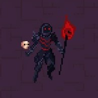

# Unity-NextRogue

<h1 align = "center"> INTRODUCTIONS </h1>

- [Game Design Document](#gamedesignDoc)
    - [Game Details](#gameDetails)
    - [Gameplay Elements](#gameplayElements)
      - [Player Mechanics](#playermechanics)
          - [Movement](#playerMovement)
          - [Combat](#playerCombat)
          - [Consumables](#playerConsumables)
      - [Summons](#summons)
      - [Enemies](#enemies)
         - [Types](#enemyTypes)
         - [Skills](#enemySkills)

<h1 align = "center" id = "gamedesignDoc"> GAME DESIGN DOCUMENT </h1>

<h2 align = "center" id = "gameDetails"> GAME DETAILS </h2>

- 
 Name :        Project - NextRogue

- 
 Genre :       Action - RogueLike/Lite

- 
 Art Style :   2D - TopDown

  
<h2 align = "center" id = "gameplayElements"> GAMEPLAY ELEMENTS </h2>

<h3 align = "center" id = "playermechanics" >PLAYER MECHANICS</h3>

I want a fast gameplay so fluid character controller is mandatory. 

Player Movement:

Main combat will be built on necromancy. So there is two types of basic atacks. 

Melee one deals little or no damage. It's main purpose is to swing enemies back.

Ranged one is one touch one cast spell. Which means there will be no casting time.
It deals little bit more damage than melee attack.

Player Combat:

  - Spells
    - Necromancy 
      - _summonDeadEnemies
        - Summons friendly creatures from enemy bodies in range
        - Doesn't consumes soul but has a cooldown.
        - Low range
      - _summonOnCursor
        - Summons choosen creature to the mouse position
        - Consumes soul
        - Mid range

Player Consumables:

  - Stamina
    - Used On Physical Movement
    - Gained Over Time
  - Souls 
    - Used On Spell Casting
    - Gained By Killing Humans

<h3 align = "center" id = "summons"> SUMMONS</h3>

Player summons different undead creatures to fight for itself. Some creatures will be able to directly controllable by the player after the spell some will wonder around by itself. There will be a lot of variety to creatures to summon.

All enemies is summonable by a _summonDeadEnemies spell.

<h3 align = "center" id = "enemies" >ENEMIES</h3>

- 
Enemy Types:

    
    - ?
    - ?
    - ?

 - 
Enemy Skills:

    - ?
    - ?
    - ?
  
