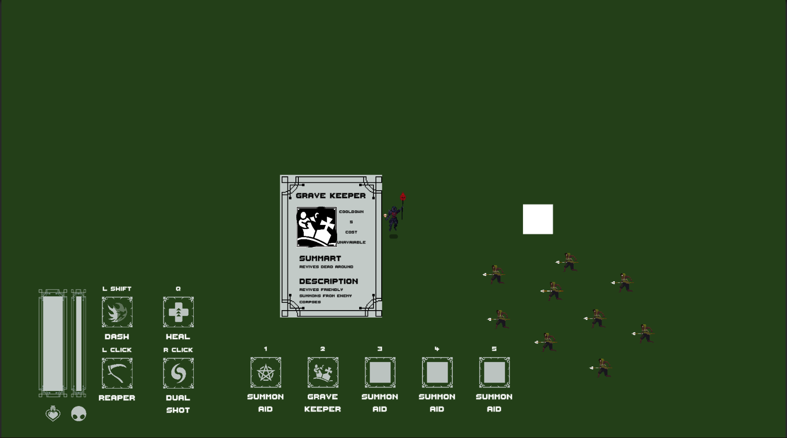
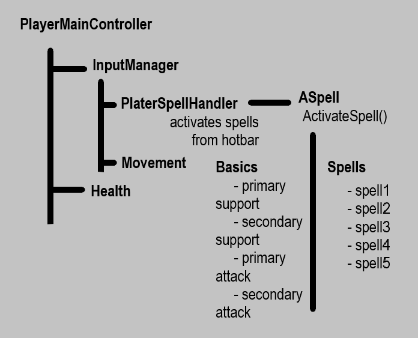

# Unity-NextRogue

<h1 align = "center"> INTRODUCTIONS </h1>

- [Game Design Document](#gamedesignDoc)
    - [Game Details](#gameDetails)
    - [Gameplay Elements](#gameplayElements)
      - [Player Mechanics](#playermechanics)
        - [Spells](#playerSpells)
        - [Consumables](#playerConsumables)
      - [Playable Characters](#playableCharacters)
      - [Non Players](#enemies)
     - [Visuals](#visuals)
       - [User Interface](#UI)
 - [Development Flow](#developmentFlow)

<h1 align = "center" id = "gamedesignDoc"> GAME DESIGN DOCUMENT </h1>

<h2 align = "center" id = "gameDetails"> GAME DETAILS </h2>

- 
 Name :        Project - NextRogue

- 
 Genre :       Action - RogueLike/Lite

- 
 Art Style :   2D - TopDown

  
<h2 align = "center" id = "gameplayElements"> GAMEPLAY ELEMENTS </h2>

<h3 align = "center" id = "playermechanics" >PLAYER MECHANICS</h3>

I want a fast gameplay so fluid character controller is mandatory. 

Main combat will be built on wizardry. There will be more than 3 unlockable characters in the game. Player can open them by playing the game.

There will be personality trait actives and passives.

Actives :
  - Primary Support : PS
  - Secondary Support : SS
  - Primary Attack : PA 
  - Seconray Attack : SA

There are no strict restrictions on passives so they will have different and quite unique passives. 

<h4 align = "center" id = "playerSpells">SPELLS</h4>

And there is spells. Any character has 5 skill slots which player can attach different spells on each run. Player will find new spells while on chests or they will be given on after boss fights.

Oher characters attacks might be used as spells in game.

Spell List :
  - Dual Shot
    - Shoots a dual projectile that explodes and give AoE on contact eachother
    - 
            Cooldown : 15
            Damage : 50
  - Ice Barrage
    - Throws 5 ice pieces in a few inches between them
    - 
            Cooldown : 20
            Damage : 15
  - Healing Ward
    - Deflects all projectiles for 1 second and heals player
    - 
            Cooldown : 15
            Heal Per Hit : 2
  
<h4 align = "center" id = "playerConsumables" >PLAYER CONSUMABLES</h4>

  - Souls 
    - Used On Spell Casting
    - Gained By Killing Humans

<h3 align = "center" id = "playableCharacters"> PLAYABLE CHARACTERS</h3>

There will be different and unique wizards to play as i said before. So there is a list of them

- NECROMANCER:
  
      Health : 50
      Movement Speed : 2.5

  - PS: Necrotic Dash
    - It dashes more if there are dead bodies around
    - 
            Cooldown : 3
            Dash Force : 10
            Corpse Range : 5
            Corpse Multiplier : 1.2
  - SS: Consume
    - Consumes alive enemies or summons to gain health
    - 
            Cooldown : 15
            Default Heal : 0
            Corpse Range : 5
            Heal Per Corpse : 3
  - PA: Reaper
    - Summons a reaper that seings itself and damages the enemies on the way
    -  
            Cooldown : 2
            Damage : 10
  - SA: Summon Aid
    - Summon 4 Axe Skeleton to help the player
    - Axe Skeleton:
      - Melee
      - Follow
      - 
            Health : 20
            Movement Speed : 4
            Attack Damage : 10
            Attack Range : .5
            Attack Speed : .75
            Life Span : 5
  
- LIGHTNING:
  - PS: Bolt Dash
    - If player dashes to an enemy it will zap around other enemies
    - Damages and shocks on contact
  - SS: Elecrticity Aura
    - Creates a aura that will dissapear on time.
    - Enemies in the aura will get shocked
  - PA: Lightning Streak
    - Shoots lightning from players hand
    - Attack will zap around other enemies on contact
  - SA: Summon Thunderbolt
    - Summons a thunderbolt that will do AOE to nearby enemies 

<h3 align = "center" id = "enemies"> ENEMIES</h3>

- Hunter:
    - Melee
    - Follow
    - 
          Health : 40
          Movement Speed : 2.5
          Attack Damage : 20
          Attack Range : .75
          Attack Speed : 1
- Bat
    - Dash
    - Keep Distance
    -
          Health : 15
          Movement Speed : 3
          Attack Damage : 15
          Attack Range : 5
          Attack Speed : 3
- Arcane Archer
    - Ranged
    - Keep Distance
    - 
          Health : 20
          Movement Speed : 3.5
          Attack Damage : 5
          Attack Range : 4
          Attack Speed : 2
  
<h1 align = "center" id = "visuals"> VISUALS </h1>
<h2 align = "center" id = "UI"> GAME </h2>

<h2 align = "center" id = "UI"> USER INTERFACE </h2>

<h3 align = "center"> GUI </h3>

<h1 align = "center" id = "developmentFlow"> DEVELOPMENT FLOW </h1>

<h2 align = "center"> PLAYER CONTROLLER </h2>

<h2 align = "center"> ENEMY CONTROLLER </h2>

